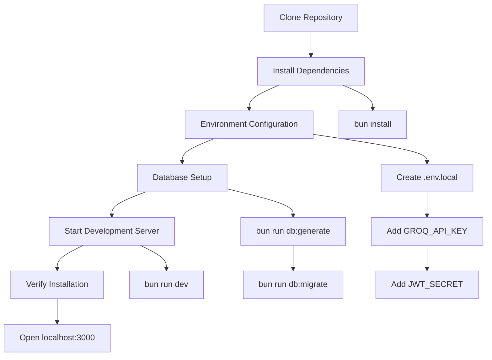
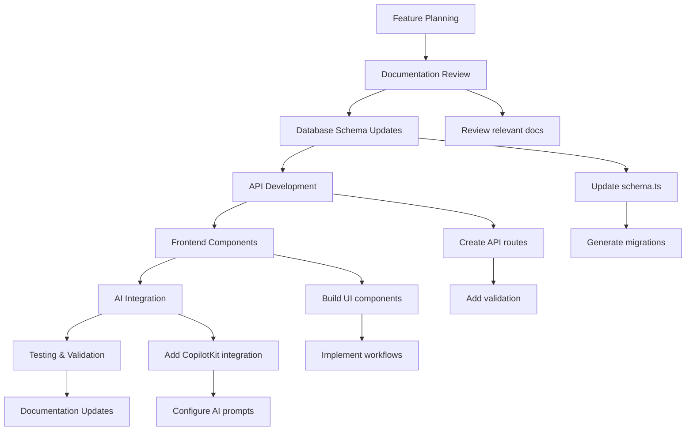
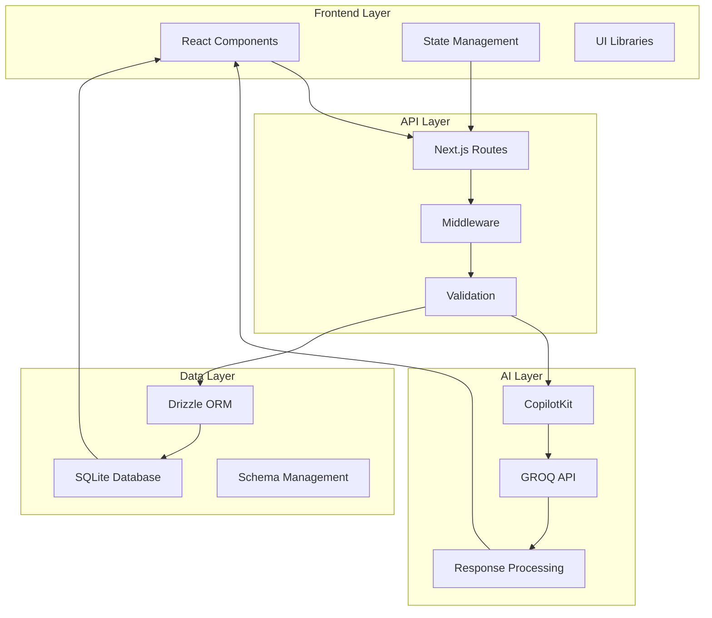

# Study Sphere Documentation Index

## 📚 Welcome to Study Sphere Documentation

This comprehensive documentation provides everything you need to understand, develop, contribute to, and deploy the Study Sphere educational platform. Study Sphere is an AI-powered learning companion that revolutionizes the way students organize, study, and retain information.

## 🎯 Quick Start Guide

### For New Users
1. 📖 Start with [Features Overview](features.md) to understand what Study Sphere offers
2. 🚀 Follow the [Database Setup Guide](db.md) to get the application running
3. 🎨 Explore the [UI Components](ui.md) to understand the interface
4. 📝 Review [Workflow Documentation](working.md) to understand user journeys

### For Developers
1. 🏗️ Review [File Structure](files.md) to understand the codebase organization
2. ⚙️ Study [Technology Stack](tech.md) to understand the technical foundation
3. 🗄️ Examine [Database Schema](schema.md) for data modeling insights
4. 🔄 Follow [Workflow Documentation](working.md) for development processes

### For Contributors
1. 📋 Read all documentation files for comprehensive understanding
2. 🔧 Set up development environment using [Database Guide](db.md)
3. 🎨 Follow [UI Guidelines](ui.md) for consistent component development
4. 📊 Understand [Data Flow](working.md#data-flow-architecture) for feature integration

## 📑 Documentation Structure

### Core Documentation Files

| File | Purpose | Target Audience | Complexity |
|------|---------|-----------------|------------|
| **[files.md](files.md)** | Project structure and file organization | Developers, Contributors | ⭐⭐⭐ |
| **[features.md](features.md)** | Complete feature documentation | All Users | ⭐⭐ |
| **[tech.md](tech.md)** | Technology stack and architecture | Developers, DevOps | ⭐⭐⭐⭐ |
| **[schema.md](schema.md)** | Database design and relationships | Backend Developers | ⭐⭐⭐⭐ |
| **[db.md](db.md)** | Database setup and configuration | Developers, DevOps | ⭐⭐⭐ |
| **[working.md](working.md)** | Workflows and user journeys | Product Managers, Developers | ⭐⭐⭐ |
| **[ui.md](ui.md)** | UI components and design system | Frontend Developers, Designers | ⭐⭐⭐ |

### Documentation Categories

#### 🏗️ Architecture & Setup
- **[Technology Stack](tech.md)** - Complete technical foundation
- **[File Structure](files.md)** - Project organization and important files
- **[Database Setup](db.md)** - Installation, configuration, and management

#### 🎨 Design & User Experience
- **[UI Components](ui.md)** - Design system and component library
- **[User Workflows](working.md)** - User journeys and interaction flows
- **[Features Overview](features.md)** - Functionality and capabilities

#### 🔧 Development & Data
- **[Database Schema](schema.md)** - Data modeling and relationships
- **[API Documentation](working.md#data-flow-architecture)** - Backend API workflows
- **[Security Implementation](working.md#security-workflow)** - Security measures and protocols

## 🚀 Getting Started Workflows

### Development Environment Setup



### Feature Development Workflow



## 📖 Feature Deep Dives

### Core Educational Features

#### 📝 Smart Notes System
- **Overview**: [Features - Notes Management](features.md#1--smart-notes-management)
- **Technical**: [UI Components - Notes Grid](ui.md#notes-grid-component-notes-gridtsx)
- **Workflow**: [Working - Notes Management](working.md#notes-management-workflow)
- **Database**: [Schema - Notes Table](schema.md#notes-table-notes)

#### 🃏 AI Flashcards Generator
- **Overview**: [Features - Flashcards](features.md#3--ai-powered-flashcards-generator)
- **Technical**: [UI Components - Flashcard](ui.md#flashcard-component-flashcardtsx)
- **Workflow**: [Working - Flashcards Generation](working.md#flashcards-generation-workflow)
- **AI Integration**: [Tech - CopilotKit](tech.md#copilotkit-framework)

#### ❓ Interactive Quizzes
- **Overview**: [Features - Quiz System](features.md#2--interactive-quiz-system)
- **Workflow**: [Working - Quiz System](working.md#quiz-system-workflow)
- **Database**: [Schema - Quiz Storage](schema.md#data-types-and-validation)

#### 🤖 Study Buddy Chat
- **Overview**: [Features - AI Mentor](features.md#4--study-buddy-ai-mentor)
- **Technical**: [Tech - AI Integration](tech.md#ai-and-machine-learning)
- **Workflow**: [Working - Chat Workflow](working.md#study-buddy-chat-workflow)
- **Database**: [Schema - Chats Table](schema.md#chats-table-chats)

### Productivity Features

#### 📋 Task Management
- **Overview**: [Features - Task Management](features.md#5--smart-task-management)
- **Workflow**: [Working - Task Creation](working.md#task-management-workflow)
- **Database**: [Schema - Tasks Table](schema.md#tasks-table-tasks)

#### 📊 Analytics & Reviews
- **Overview**: [Features - Daily Reviews](features.md#6--daily-reviews-and-analytics)
- **Workflow**: [Working - Daily Review](working.md#daily-review-workflow)
- **Database**: [Schema - Reviews Table](schema.md#daily-reviews-table-dailyreviews)

## 🔧 Technical Reference

### Development Guides

#### Backend Development
1. **API Routes**: [File Structure - API Routes](files.md#api-routes-srcappapi)
2. **Database Operations**: [Database Setup](db.md#schema-management)
3. **Authentication**: [Schema - Users Table](schema.md#users-table-users)
4. **AI Integration**: [Tech - GROQ SDK](tech.md#groq-sdk-050)

#### Frontend Development
1. **Component System**: [UI Components](ui.md#component-library)
2. **Design Tokens**: [UI - Design System](ui.md#design-system-foundation)
3. **State Management**: [Tech - Architecture Patterns](tech.md#architecture-patterns)
4. **Responsive Design**: [UI - Responsive Design](ui.md#responsive-design)

#### DevOps & Deployment
1. **Environment Setup**: [Database - Environment Configuration](db.md#environment-configuration)
2. **Database Management**: [Database - Migration Management](db.md#migration-management)
3. **Performance**: [Database - Performance Optimization](db.md#performance-optimization)
4. **Security**: [Working - Security Workflow](working.md#security-workflow)

### API Reference

#### Authentication Endpoints
```typescript
POST /api/auth/register    // User registration
POST /api/auth/login       // User login
POST /api/auth/logout      // User logout
GET  /api/auth/session     // Session validation
GET  /api/auth/me          // Current user info
```

#### Feature Endpoints
```typescript
// Notes Management
GET    /api/notes          // Get user notes
POST   /api/notes          // Create note
PUT    /api/notes/:id      // Update note
DELETE /api/notes/:id      // Delete note

// Tasks Management
GET    /api/tasks          // Get user tasks
POST   /api/tasks          // Create task
PUT    /api/tasks/:id      // Update task
DELETE /api/tasks/:id      // Delete task

// AI Integration
POST   /api/copilotkit    // Main AI endpoint
POST   /api/copilotkit/generate-flashcards  // Flashcard generation

// Chat System
GET    /api/chats         // Get chat history
POST   /api/chats         // Save chat interaction
DELETE /api/chats/:id     // Delete chat

// User Settings
GET    /api/user-settings // Get user preferences
PUT    /api/user-settings // Update preferences

// Daily Reviews
GET    /api/daily-reviews // Get review history
POST   /api/daily-reviews // Create review
```

## 📊 Data Flow Overview

### High-Level Data Architecture



### Security & Privacy

#### Data Protection Measures
- **Authentication**: [Working - Authentication Workflow](working.md#user-authentication-workflow)
- **Authorization**: [Working - Security Pipeline](working.md#security-workflow)
- **Data Isolation**: [Schema - Relationships](schema.md#database-relationships)
- **Input Validation**: [Schema - Validation](schema.md#data-types-and-validation)

#### Privacy Compliance
- **User Data**: [Schema - Data Security](schema.md#data-security-and-privacy)
- **Session Management**: [Tech - JWT](tech.md#json-web-tokens-jwt)
- **AI Data**: Conversations and AI interactions are user-isolated
- **Backup Security**: [Database - Backup Security](db.md#security-considerations)

## 🧪 Testing & Quality Assurance

### Testing Strategy
1. **Unit Tests**: Component and utility function testing
2. **Integration Tests**: API endpoint and database operation testing
3. **E2E Tests**: Complete user workflow testing
4. **AI Tests**: AI response quality and consistency testing

### Quality Standards
- **Code Quality**: [Tech - Biome](tech.md#biome-194)
- **Type Safety**: [Tech - TypeScript](tech.md#typescript-5)
- **Performance**: [Working - Performance Optimization](working.md#performance-optimization-workflow)
- **Accessibility**: [UI - Accessibility Features](ui.md#accessibility-features)

## 🚢 Deployment & Operations

### Deployment Options
1. **Development**: Local development with SQLite
2. **Staging**: Cloud deployment with managed database
3. **Production**: Scalable cloud infrastructure

### Monitoring & Maintenance
- **Error Tracking**: [Working - Error Handling](working.md#error-handling-workflow)
- **Performance Monitoring**: Database and API performance tracking
- **User Analytics**: Learning pattern analysis and improvements
- **AI Performance**: Model response quality and speed monitoring

## 🤝 Contributing Guidelines

### Development Process
1. **Issue Creation**: Describe feature or bug with clear requirements
2. **Branch Strategy**: Feature branches from main development branch
3. **Code Standards**: Follow established patterns and conventions
4. **Documentation**: Update relevant documentation files
5. **Testing**: Ensure comprehensive test coverage
6. **Review Process**: Peer review and quality assurance

### Code Organization
- **File Structure**: [Files Documentation](files.md)
- **Component Patterns**: [UI Components](ui.md)
- **Database Changes**: [Schema Management](schema.md)
- **API Development**: [Working - Data Flow](working.md#data-flow-architecture)

## 📚 Learning Resources

### For New Developers
1. **Next.js**: Official Next.js documentation and tutorials
2. **React**: React fundamentals and hooks
3. **TypeScript**: Type-safe JavaScript development
4. **Tailwind CSS**: Utility-first CSS framework
5. **Drizzle ORM**: Type-safe database operations

### For AI Integration
1. **CopilotKit**: AI-powered UI framework documentation
2. **GROQ**: Large language model API documentation
3. **Prompt Engineering**: Best practices for AI prompts
4. **Educational AI**: AI applications in learning environments

## 🔗 External Links & Resources

### Official Documentation
- [Next.js Documentation](https://nextjs.org/docs)
- [React Documentation](https://react.dev/)
- [TypeScript Handbook](https://www.typescriptlang.org/docs/)
- [Tailwind CSS](https://tailwindcss.com/docs)
- [Drizzle ORM](https://orm.drizzle.team/)
- [CopilotKit](https://docs.copilotkit.ai/)

### Community & Support
- **GitHub Repository**: Main codebase and issue tracking
- **Discussion Forums**: Community support and feature requests
- **Development Blog**: Updates and technical insights
- **Educational Resources**: Learning materials and tutorials

## 📝 Documentation Maintenance

### Update Schedule
- **Weekly**: Minor updates and corrections
- **Monthly**: Feature additions and improvements
- **Quarterly**: Major restructuring and comprehensive reviews
- **Release-based**: Documentation updates with each version release

### Contributing to Documentation
1. **Accuracy**: Ensure all technical details are current
2. **Clarity**: Write for your target audience level
3. **Completeness**: Cover all aspects of the topic
4. **Examples**: Provide practical code examples
5. **Cross-references**: Link to related documentation sections

---

## 📞 Support & Contact

For questions, issues, or contributions:
- **Technical Issues**: Review relevant documentation sections
- **Bug Reports**: Create detailed issue reports with reproduction steps
- **Feature Requests**: Propose enhancements with clear use cases
- **Documentation Issues**: Report unclear or outdated content

**Happy Learning with Study Sphere! 🚀📚**
