# Study Sphere Workflow Documentation

## Overview
This document describes the comprehensive workflow and operational processes of Study Sphere, an AI-powered educational platform. It covers user journeys, system interactions, data flow, and feature workflows with detailed flowcharts and process descriptions.

## System Architecture Workflow

### High-Level System Flow

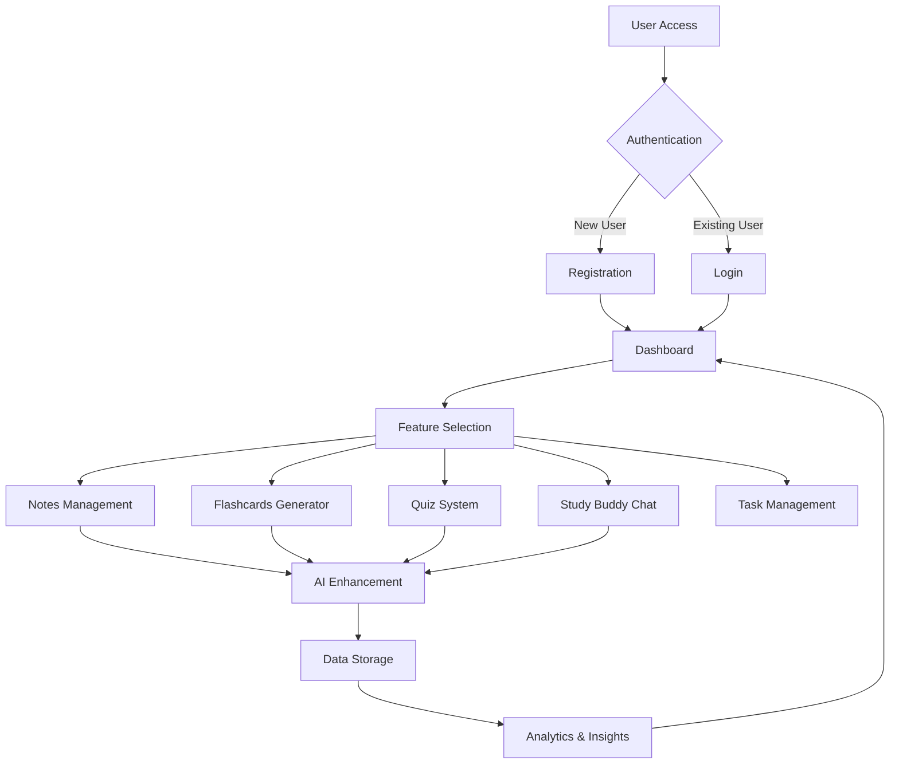
```mermaid
graph TB
    A[User Access] --> B{Authentication}
    B -->|New User| C[Registration]
    B -->|Existing User| D[Login]
    C --> E[Dashboard]
    D --> E[Dashboard]
    E --> F[Feature Selection]
    F --> G[Notes Management]
    F --> H[Flashcards Generator]
    F --> I[Quiz System]
    F --> J[Study Buddy Chat]
    F --> K[Task Management]
    G --> L[AI Enhancement]
    H --> L
    I --> L
    J --> L
    L --> M[Data Storage]
    M --> N[Analytics & Insights]
    N --> E
```

### System Components Interaction

1. **Frontend Layer**: Next.js React application with server-side rendering
2. **API Layer**: RESTful endpoints with Next.js App Router
3. **AI Integration**: CopilotKit with GROQ backend for intelligent features
4. **Database Layer**: SQLite with Drizzle ORM for data persistence
5. **Authentication**: JWT-based session management with secure cookies

## User Authentication Workflow

### Registration Process

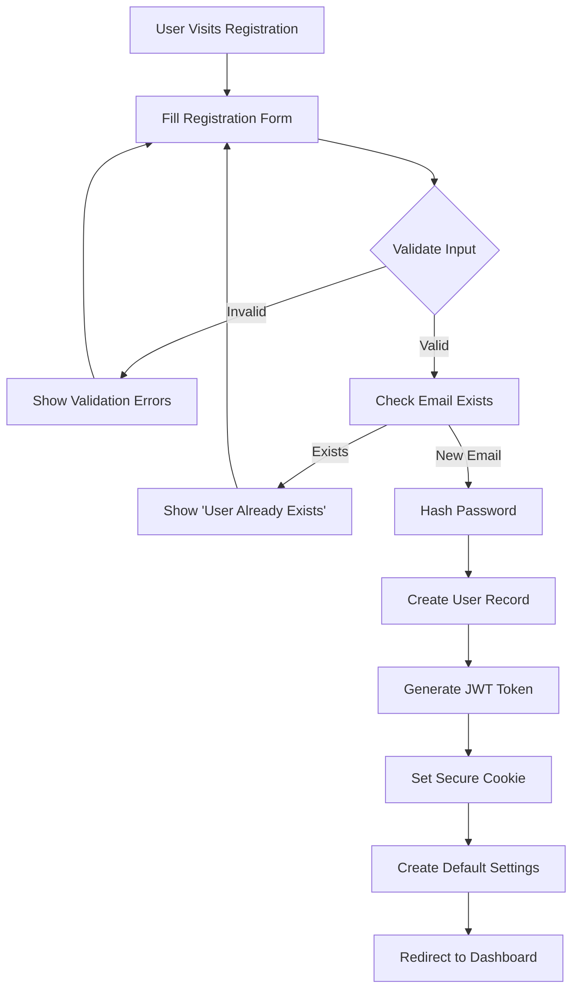
```mermaid
flowchart TD
    A[User Visits Registration] --> B[Fill Registration Form]
    B --> C{Validate Input}
    C -->|Invalid| D[Show Validation Errors]
    D --> B
    C -->|Valid| E[Check Email Exists]
    E -->|Exists| F[Show 'User Already Exists']
    F --> B
    E -->|New Email| G[Hash Password]
    G --> H[Create User Record]
    H --> I[Generate JWT Token]
    I --> J[Set Secure Cookie]
    J --> K[Create Default Settings]
    K --> L[Redirect to Dashboard]
```

#### Registration Steps Breakdown

1. **Form Validation**:
   - Email format validation
   - Password strength requirements
   - Name field completion
   - Client-side and server-side validation

2. **Security Measures**:
   - Password hashing with bcrypt
   - Email uniqueness check
   - JWT token generation with expiration
   - Secure HTTP-only cookie setting

3. **Default Setup**:
   - User settings initialization
   - Welcome message preparation
   - Dashboard data setup

### Login Process

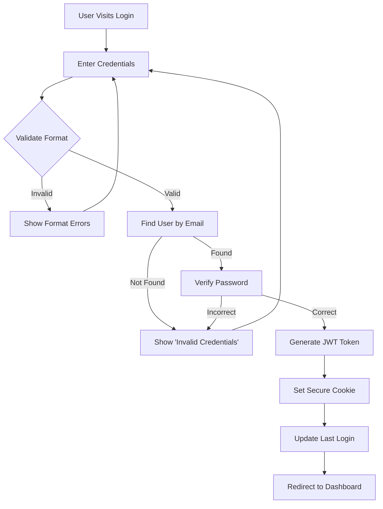
```mermaid
flowchart TD
    A[User Visits Login] --> B[Enter Credentials]
    B --> C{Validate Format}
    C -->|Invalid| D[Show Format Errors]
    D --> B
    C -->|Valid| E[Find User by Email]
    E -->|Not Found| F[Show 'Invalid Credentials']
    F --> B
    E -->|Found| G[Verify Password]
    G -->|Incorrect| F
    G -->|Correct| H[Generate JWT Token]
    H --> I[Set Secure Cookie]
    I --> J[Update Last Login]
    J --> K[Redirect to Dashboard]
```

### Session Management

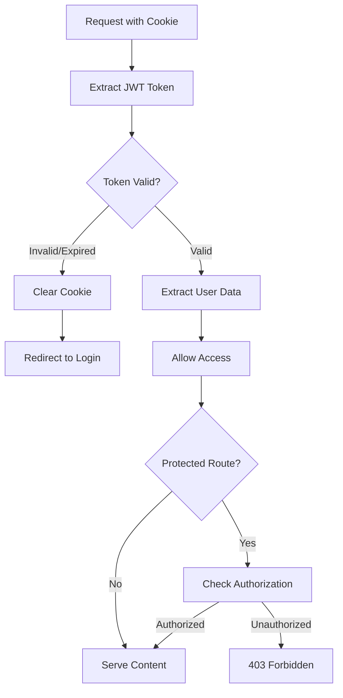
```mermaid
flowchart TD
    A[Request with Cookie] --> B[Extract JWT Token]
    B --> C{Token Valid?}
    C -->|Invalid/Expired| D[Clear Cookie]
    D --> E[Redirect to Login]
    C -->|Valid| F[Extract User Data]
    F --> G[Allow Access]
    G --> H{Protected Route?}
    H -->|Yes| I[Check Authorization]
    H -->|No| J[Serve Content]
    I -->|Authorized| J
    I -->|Unauthorized| K[403 Forbidden]
```

## Core Feature Workflows

### Notes Management Workflow

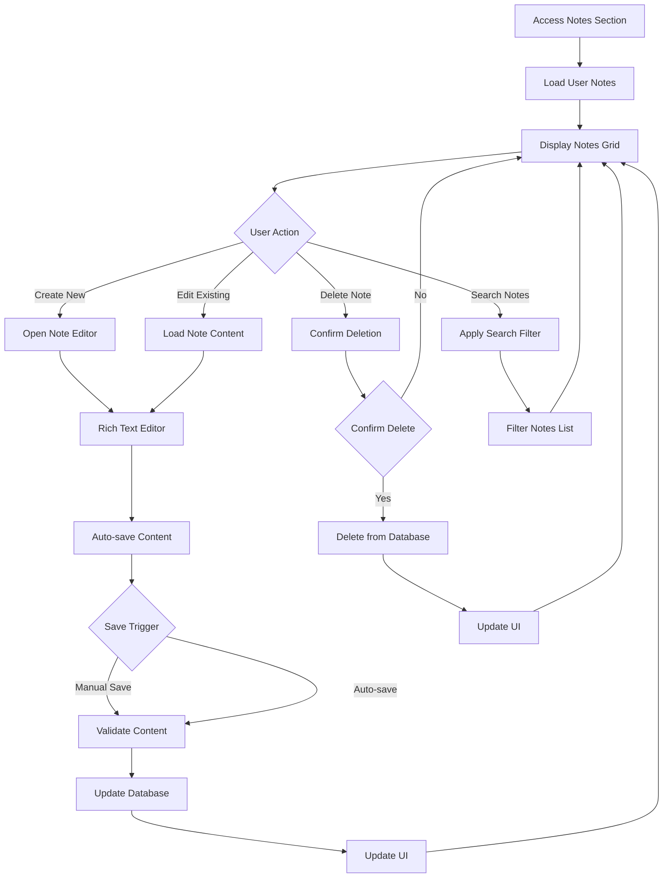
```mermaid
flowchart TD
    A[Access Notes Section] --> B[Load User Notes]
    B --> C[Display Notes Grid]
    C --> D{User Action}
    D -->|Create New| E[Open Note Editor]
    D -->|Edit Existing| F[Load Note Content]
    D -->|Delete Note| G[Confirm Deletion]
    D -->|Search Notes| H[Apply Search Filter]
    
    E --> I[Rich Text Editor]
    F --> I
    I --> J[Auto-save Content]
    J --> K{Save Trigger}
    K -->|Manual Save| L[Validate Content]
    K -->|Auto-save| L
    L --> M[Update Database]
    M --> N[Update UI]
    N --> C
    
    G --> O{Confirm Delete}
    O -->|Yes| P[Delete from Database]
    O -->|No| C
    P --> Q[Update UI]
    Q --> C
    
    H --> R[Filter Notes List]
    R --> C
```

#### Notes Feature Details

1. **Content Creation**:
   - Rich text editor with formatting options
   - Category tagging system
   - Auto-save functionality every 30 seconds
   - Manual save option

2. **Content Organization**:
   - Multi-tag categorization
   - Search functionality across title and content
   - Date-based sorting options
   - Grid and list view modes

3. **AI Integration**:
   - Content suggestions based on existing notes
   - Smart categorization recommendations
   - Grammar and style improvements

### Flashcards Generation Workflow

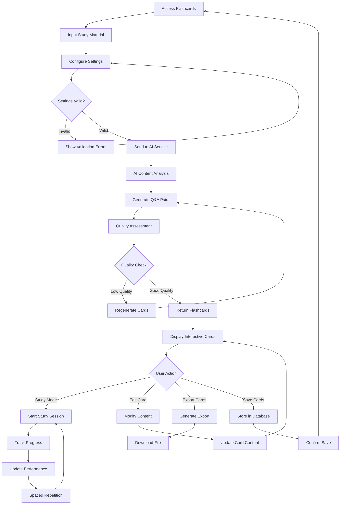
```mermaid
flowchart TD
    A[Access Flashcards] --> B[Input Study Material]
    B --> C[Configure Settings]
    C --> D{Settings Valid?}
    D -->|Invalid| E[Show Validation Errors]
    E --> C
    D -->|Valid| F[Send to AI Service]
    F --> G[AI Content Analysis]
    G --> H[Generate Q&A Pairs]
    H --> I[Quality Assessment]
    I --> J{Quality Check}
    J -->|Low Quality| K[Regenerate Cards]
    K --> H
    J -->|Good Quality| L[Return Flashcards]
    L --> M[Display Interactive Cards]
    M --> N{User Action}
    N -->|Study Mode| O[Start Study Session]
    N -->|Edit Card| P[Modify Content]
    N -->|Export Cards| Q[Generate Export]
    N -->|Save Cards| R[Store in Database]
    
    O --> S[Track Progress]
    S --> T[Update Performance]
    T --> U[Spaced Repetition]
    U --> O
    
    P --> V[Update Card Content]
    V --> M
    
    Q --> W[Download File]
    
    R --> X[Confirm Save]
    X --> A
```

#### Flashcards Generation Process

1. **Content Input**:
   - Text area for study material
   - File upload support (future feature)
   - Content validation and preprocessing

2. **AI Processing**:
   - Content analysis using GROQ AI
   - Key concept extraction
   - Question-answer pair generation
   - Difficulty level adjustment

3. **Study Features**:
   - Interactive card flipping
   - Progress tracking
   - Spaced repetition algorithm
   - Performance analytics

### Quiz System Workflow

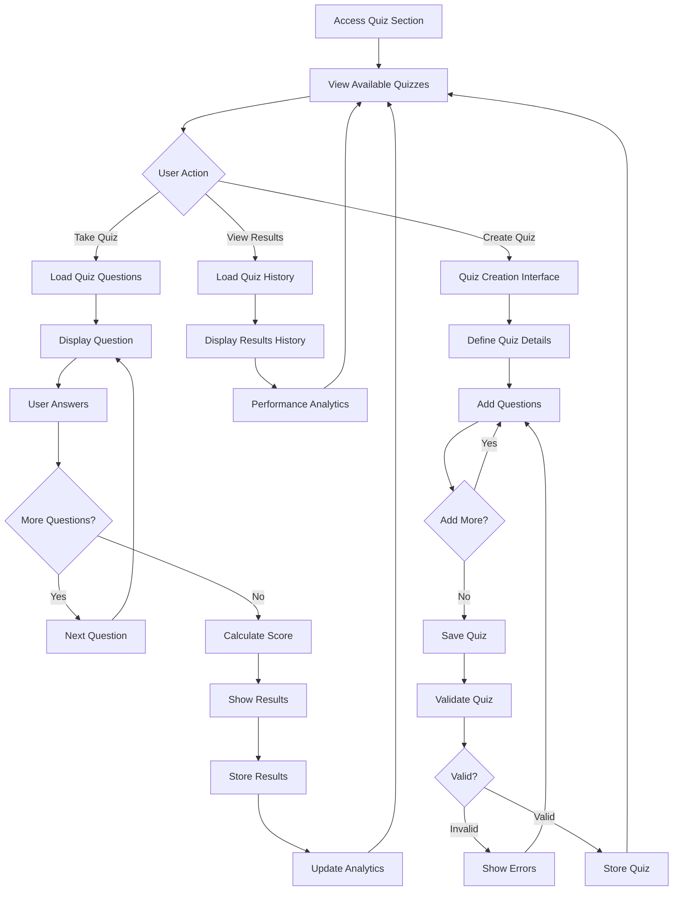
```mermaid
flowchart TD
    A[Access Quiz Section] --> B[View Available Quizzes]
    B --> C{User Action}
    C -->|Take Quiz| D[Load Quiz Questions]
    C -->|Create Quiz| E[Quiz Creation Interface]
    C -->|View Results| F[Load Quiz History]
    
    D --> G[Display Question]
    G --> H[User Answers]
    H --> I{More Questions?}
    I -->|Yes| J[Next Question]
    J --> G
    I -->|No| K[Calculate Score]
    K --> L[Show Results]
    L --> M[Store Results]
    M --> N[Update Analytics]
    N --> B
    
    E --> O[Define Quiz Details]
    O --> P[Add Questions]
    P --> Q{Add More?}
    Q -->|Yes| P
    Q -->|No| R[Save Quiz]
    R --> S[Validate Quiz]
    S --> T{Valid?}
    T -->|Invalid| U[Show Errors]
    U --> P
    T -->|Valid| V[Store Quiz]
    V --> B
    
    F --> W[Display Results History]
    W --> X[Performance Analytics]
    X --> B
```

### Study Buddy Chat Workflow

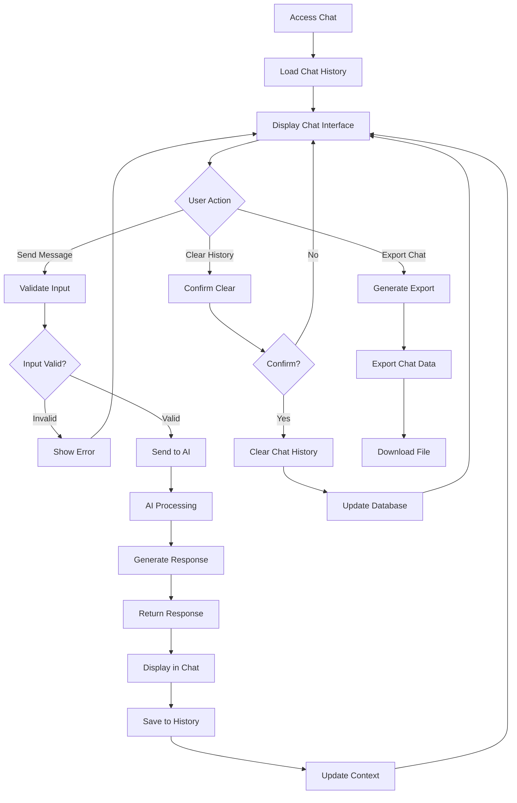
```mermaid
flowchart TD
    A[Access Chat] --> B[Load Chat History]
    B --> C[Display Chat Interface]
    C --> D{User Action}
    D -->|Send Message| E[Validate Input]
    D -->|Clear History| F[Confirm Clear]
    D -->|Export Chat| G[Generate Export]
    
    E --> H{Input Valid?}
    H -->|Invalid| I[Show Error]
    I --> C
    H -->|Valid| J[Send to AI]
    J --> K[AI Processing]
    K --> L[Generate Response]
    L --> M[Return Response]
    M --> N[Display in Chat]
    N --> O[Save to History]
    O --> P[Update Context]
    P --> C
    
    F --> Q{Confirm?}
    Q -->|Yes| R[Clear Chat History]
    Q -->|No| C
    R --> S[Update Database]
    S --> C
    
    G --> T[Export Chat Data]
    T --> U[Download File]
```

## Task Management Workflow

### Task Creation and Management

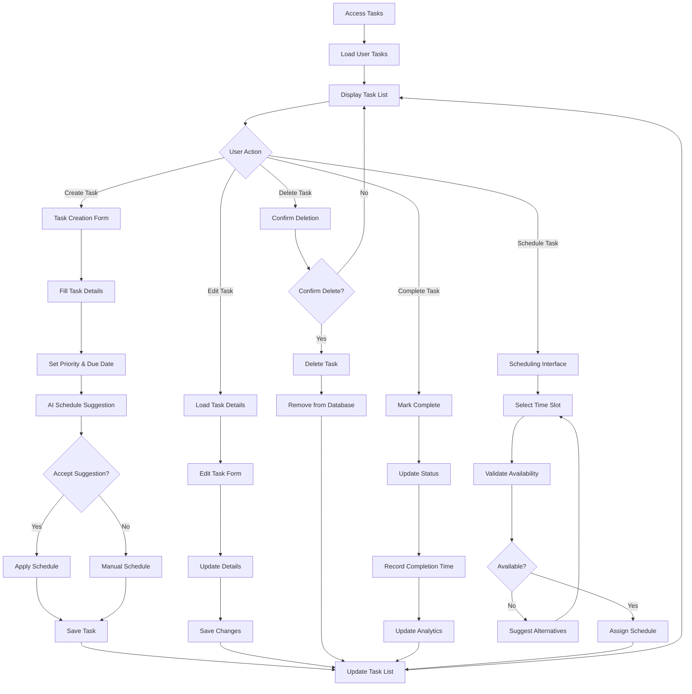
```mermaid
flowchart TD
    A[Access Tasks] --> B[Load User Tasks]
    B --> C[Display Task List]
    C --> D{User Action}
    D -->|Create Task| E[Task Creation Form]
    D -->|Edit Task| F[Load Task Details]
    D -->|Delete Task| G[Confirm Deletion]
    D -->|Complete Task| H[Mark Complete]
    D -->|Schedule Task| I[Scheduling Interface]
    
    E --> J[Fill Task Details]
    J --> K[Set Priority & Due Date]
    K --> L[AI Schedule Suggestion]
    L --> M{Accept Suggestion?}
    M -->|Yes| N[Apply Schedule]
    M -->|No| O[Manual Schedule]
    N --> P[Save Task]
    O --> P
    P --> Q[Update Task List]
    Q --> C
    
    F --> R[Edit Task Form]
    R --> S[Update Details]
    S --> T[Save Changes]
    T --> Q
    
    G --> U{Confirm Delete?}
    U -->|Yes| V[Delete Task]
    U -->|No| C
    V --> W[Remove from Database]
    W --> Q
    
    H --> X[Update Status]
    X --> Y[Record Completion Time]
    Y --> Z[Update Analytics]
    Z --> Q
    
    I --> AA[Select Time Slot]
    AA --> BB[Validate Availability]
    BB --> CC{Available?}
    CC -->|Yes| DD[Assign Schedule]
    CC -->|No| EE[Suggest Alternatives]
    EE --> AA
    DD --> Q
```

### Daily Review Workflow

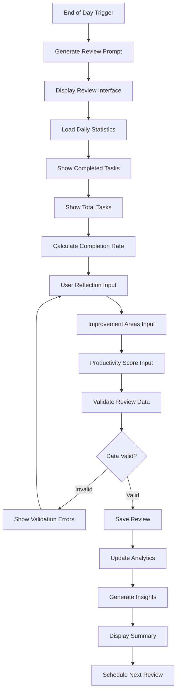
```mermaid
flowchart TD
    A[End of Day Trigger] --> B[Generate Review Prompt]
    B --> C[Display Review Interface]
    C --> D[Load Daily Statistics]
    D --> E[Show Completed Tasks]
    E --> F[Show Total Tasks]
    F --> G[Calculate Completion Rate]
    G --> H[User Reflection Input]
    H --> I[Improvement Areas Input]
    I --> J[Productivity Score Input]
    J --> K[Validate Review Data]
    K --> L{Data Valid?}
    L -->|Invalid| M[Show Validation Errors]
    M --> H
    L -->|Valid| N[Save Review]
    N --> O[Update Analytics]
    O --> P[Generate Insights]
    P --> Q[Display Summary]
    Q --> R[Schedule Next Review]
```

## AI Integration Workflow

### CopilotKit AI Processing

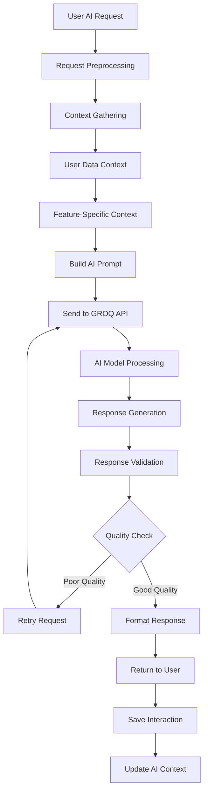
```mermaid
flowchart TD
    A[User AI Request] --> B[Request Preprocessing]
    B --> C[Context Gathering]
    C --> D[User Data Context]
    D --> E[Feature-Specific Context]
    E --> F[Build AI Prompt]
    F --> G[Send to GROQ API]
    G --> H[AI Model Processing]
    H --> I[Response Generation]
    I --> J[Response Validation]
    J --> K{Quality Check}
    K -->|Poor Quality| L[Retry Request]
    L --> G
    K -->|Good Quality| M[Format Response]
    M --> N[Return to User]
    N --> O[Save Interaction]
    O --> P[Update AI Context]
```

### AI Context Management

1. **User Context**:
   - Previous interactions
   - Learning preferences
   - Performance history
   - Current study topics

2. **Feature Context**:
   - Notes content for suggestions
   - Task history for scheduling
   - Quiz performance for difficulty
   - Chat history for continuity

3. **Response Optimization**:
   - Educational tone and style
   - Appropriate complexity level
   - Actionable suggestions
   - Encouraging feedback

## Data Flow Architecture

### Request-Response Cycle

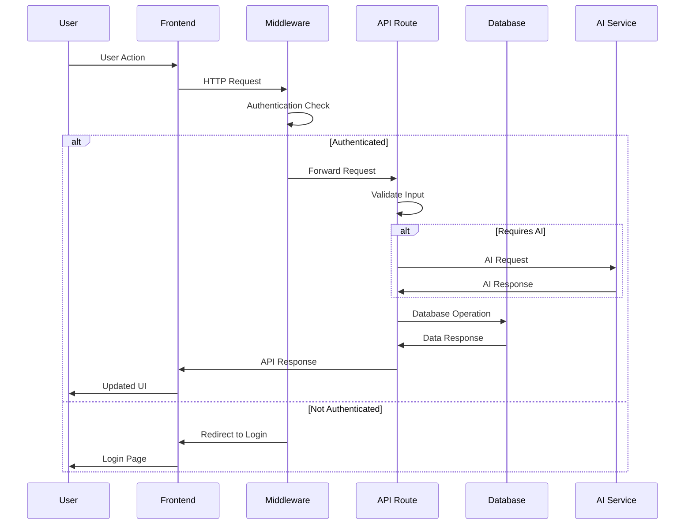
```mermaid
sequenceDiagram
    participant U as User
    participant F as Frontend
    participant M as Middleware
    participant A as API Route
    participant D as Database
    participant AI as AI Service

    U->>F: User Action
    F->>M: HTTP Request
    M->>M: Authentication Check
    alt Authenticated
        M->>A: Forward Request
        A->>A: Validate Input
        alt Requires AI
            A->>AI: AI Request
            AI->>A: AI Response
        end
        A->>D: Database Operation
        D->>A: Data Response
        A->>F: API Response
        F->>U: Updated UI
    else Not Authenticated
        M->>F: Redirect to Login
        F->>U: Login Page
    end
```

### Data Synchronization

1. **Real-time Updates**:
   - WebSocket connections for live features
   - Optimistic UI updates
   - Conflict resolution strategies

2. **Offline Support**:
   - Local storage for critical data
   - Sync queue for offline actions
   - Conflict resolution on reconnection

## Performance Optimization Workflow

### Caching Strategy

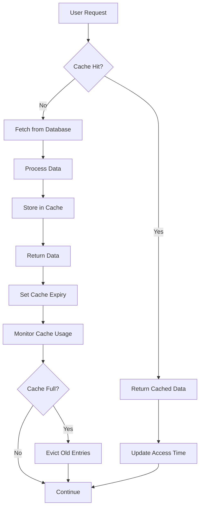
```mermaid
flowchart TD
    A[User Request] --> B{Cache Hit?}
    B -->|Yes| C[Return Cached Data]
    B -->|No| D[Fetch from Database]
    D --> E[Process Data]
    E --> F[Store in Cache]
    F --> G[Return Data]
    G --> H[Set Cache Expiry]
    H --> I[Monitor Cache Usage]
    I --> J{Cache Full?}
    J -->|Yes| K[Evict Old Entries]
    J -->|No| L[Continue]
    K --> L
    C --> M[Update Access Time]
    M --> L
```

### Database Optimization

1. **Query Optimization**:
   - Index usage for common queries
   - Prepared statement reuse
   - Batch operations for bulk updates

2. **Connection Management**:
   - Connection pooling
   - Timeout management
   - Health monitoring

## Error Handling Workflow

### Error Processing Pipeline

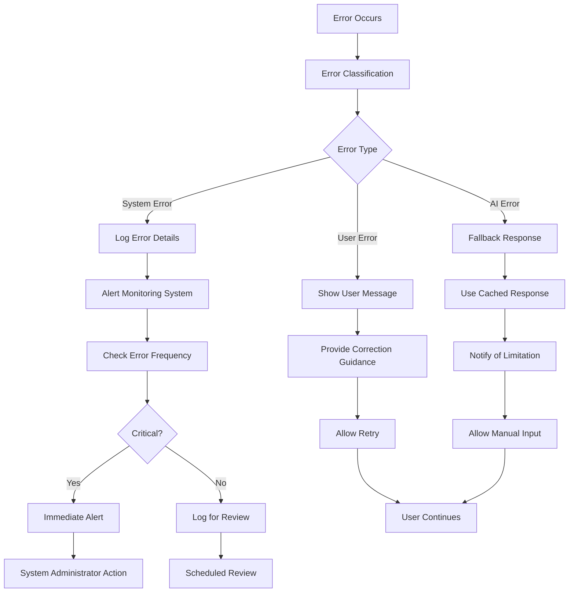
```mermaid
flowchart TD
    A[Error Occurs] --> B[Error Classification]
    B --> C{Error Type}
    C -->|User Error| D[Show User Message]
    C -->|System Error| E[Log Error Details]
    C -->|AI Error| F[Fallback Response]
    
    D --> G[Provide Correction Guidance]
    G --> H[Allow Retry]
    
    E --> I[Alert Monitoring System]
    I --> J[Check Error Frequency]
    J --> K{Critical?}
    K -->|Yes| L[Immediate Alert]
    K -->|No| M[Log for Review]
    
    F --> N[Use Cached Response]
    N --> O[Notify of Limitation]
    O --> P[Allow Manual Input]
    
    H --> Q[User Continues]
    L --> R[System Administrator Action]
    M --> S[Scheduled Review]
    P --> Q
```

## Security Workflow

### Security Checks Pipeline

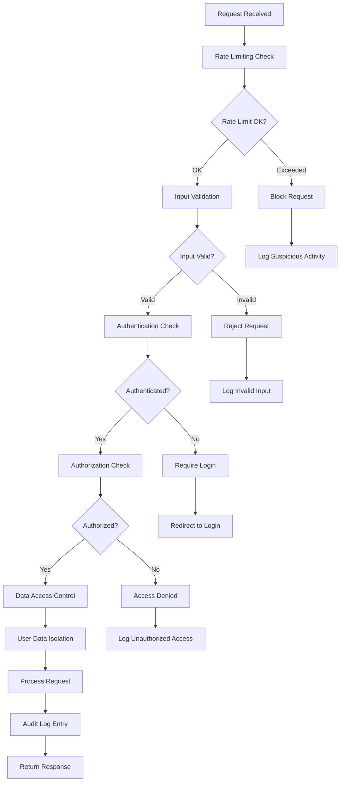
```mermaid
flowchart TD
    A[Request Received] --> B[Rate Limiting Check]
    B --> C{Rate Limit OK?}
    C -->|Exceeded| D[Block Request]
    C -->|OK| E[Input Validation]
    E --> F{Input Valid?}
    F -->|Invalid| G[Reject Request]
    F -->|Valid| H[Authentication Check]
    H --> I{Authenticated?}
    I -->|No| J[Require Login]
    I -->|Yes| K[Authorization Check]
    K --> L{Authorized?}
    L -->|No| M[Access Denied]
    L -->|Yes| N[Data Access Control]
    N --> O[User Data Isolation]
    O --> P[Process Request]
    P --> Q[Audit Log Entry]
    Q --> R[Return Response]
    
    D --> S[Log Suspicious Activity]
    G --> T[Log Invalid Input]
    J --> U[Redirect to Login]
    M --> V[Log Unauthorized Access]
```

## Advanced Workflow Patterns

### Microinteraction Workflows

#### Auto-save Mechanism
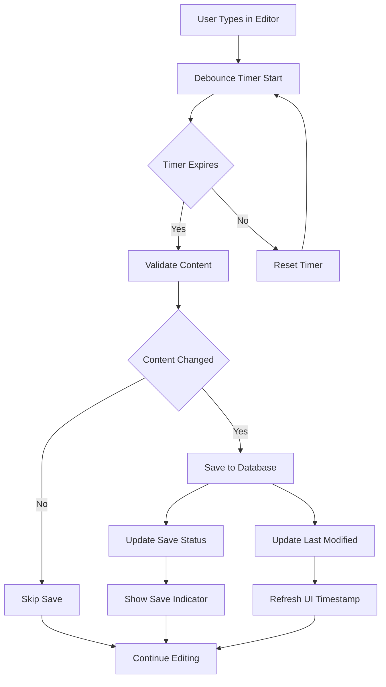
```mermaid
flowchart TD
    A[User Types in Editor] --> B[Debounce Timer Start]
    B --> C{Timer Expires}
    C -->|Yes| D[Validate Content]
    C -->|No| E[Reset Timer]
    E --> B
    D --> F{Content Changed}
    F -->|Yes| G[Save to Database]
    F -->|No| H[Skip Save]
    G --> I[Update Save Status]
    G --> J[Update Last Modified]
    I --> K[Show Save Indicator]
    J --> L[Refresh UI Timestamp]
    H --> M[Continue Editing]
    K --> M
    L --> M
```

#### Smart Notification System
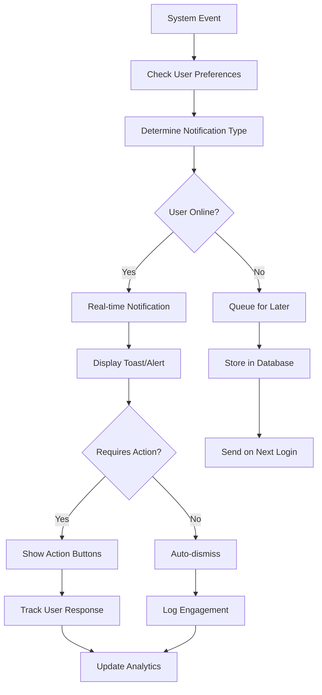
```mermaid
flowchart TD
    A[System Event] --> B[Check User Preferences]
    B --> C[Determine Notification Type]
    C --> D{User Online?}
    D -->|Yes| E[Real-time Notification]
    D -->|No| F[Queue for Later]
    E --> G[Display Toast/Alert]
    F --> H[Store in Database]
    G --> I{Requires Action?}
    H --> J[Send on Next Login]
    I -->|Yes| K[Show Action Buttons]
    I -->|No| L[Auto-dismiss]
    K --> M[Track User Response]
    L --> N[Log Engagement]
    M --> O[Update Analytics]
    N --> O
```

### Content Management Workflows

#### Rich Text Processing Pipeline
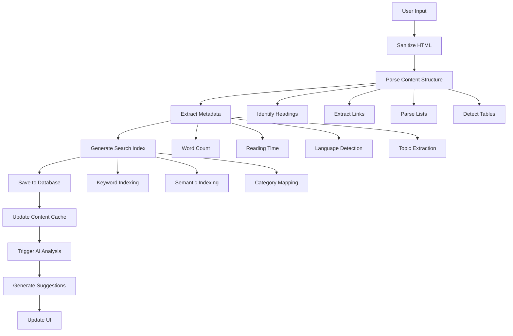
```mermaid
flowchart TD
    A[User Input] --> B[Sanitize HTML]
    B --> C[Parse Content Structure]
    C --> D[Extract Metadata]
    D --> E[Generate Search Index]
    E --> F[Save to Database]
    F --> G[Update Content Cache]
    G --> H[Trigger AI Analysis]
    H --> I[Generate Suggestions]
    I --> J[Update UI]
    
    C --> C1[Identify Headings]
    C --> C2[Extract Links]
    C --> C3[Parse Lists]
    C --> C4[Detect Tables]
    
    D --> D1[Word Count]
    D --> D2[Reading Time]
    D --> D3[Language Detection]
    D --> D4[Topic Extraction]
    
    E --> E1[Keyword Indexing]
    E --> E2[Semantic Indexing]
    E --> E3[Category Mapping]
```

#### Version Control System
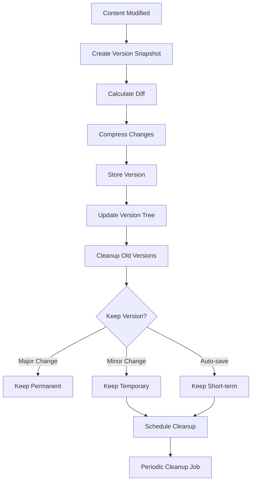
```mermaid
flowchart TD
    A[Content Modified] --> B[Create Version Snapshot]
    B --> C[Calculate Diff]
    C --> D[Compress Changes]
    D --> E[Store Version]
    E --> F[Update Version Tree]
    F --> G[Cleanup Old Versions]
    
    G --> H{Keep Version?}
    H -->|Major Change| I[Keep Permanent]
    H -->|Minor Change| J[Keep Temporary]
    H -->|Auto-save| K[Keep Short-term]
    
    J --> L[Schedule Cleanup]
    K --> L
    L --> M[Periodic Cleanup Job]
```

## Advanced AI Integration Workflows

### Intelligent Content Enhancement

#### Content Analysis Pipeline
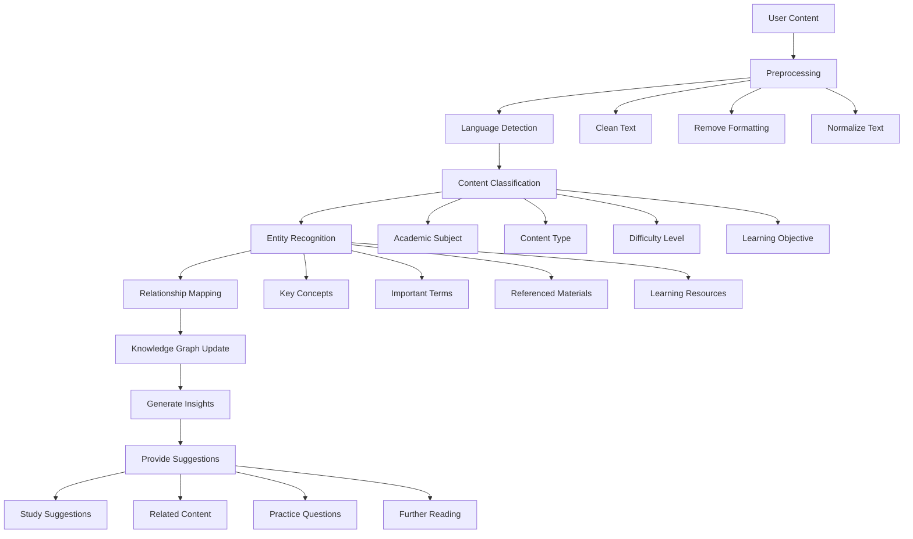
```mermaid
flowchart TD
    A[User Content] --> B[Preprocessing]
    B --> C[Language Detection]
    C --> D[Content Classification]
    D --> E[Entity Recognition]
    E --> F[Relationship Mapping]
    F --> G[Knowledge Graph Update]
    G --> H[Generate Insights]
    H --> I[Provide Suggestions]
    
    B --> B1[Clean Text]
    B --> B2[Remove Formatting]
    B --> B3[Normalize Text]
    
    D --> D1[Academic Subject]
    D --> D2[Content Type]
    D --> D3[Difficulty Level]
    D --> D4[Learning Objective]
    
    E --> E1[Key Concepts]
    E --> E2[Important Terms]
    E --> E3[Referenced Materials]
    E --> E4[Learning Resources]
    
    I --> I1[Study Suggestions]
    I --> I2[Related Content]
    I --> I3[Practice Questions]
    I --> I4[Further Reading]
```

#### Adaptive Learning Algorithm
```mermaid
flowchart TD
    A[User Interaction] --> B[Collect Performance Data]
    B --> C[Analyze Learning Patterns]
    C --> D[Update User Model]
    D --> E[Adjust Difficulty]
    E --> F[Personalize Content]
    F --> G[Generate Recommendations]
    G --> H[Present to User]
    H --> I[Monitor Response]
    I --> J[Update Feedback Loop]
    J --> A
    
    C --> C1[Success Rate Analysis]
    C --> C2[Time-on-Task Metrics]
    C --> C3[Error Pattern Recognition]
    C --> C4[Engagement Tracking]
    
    D --> D1[Skill Level Assessment]
    D --> D2[Learning Style Profile]
    D --> D3[Preference Mapping]
    D --> D4[Progress Tracking]
    
    F --> F1[Content Difficulty]
    F --> F2[Presentation Style]
    F --> F3[Practice Frequency]
    F --> F4[Review Scheduling]
```

### Collaborative Learning Workflows

#### Study Group Formation
```mermaid
flowchart TD
    A[User Requests Study Group] --> B[Analyze User Profile]
    B --> C[Find Compatible Users]
    C --> D[Check Availability]
    D --> E[Create Group Suggestions]
    E --> F[Send Invitations]
    F --> G[Manage Responses]
    G --> H{Group Formed?}
    H -->|Yes| I[Setup Group Space]
    H -->|No| J[Retry with Different Criteria]
    I --> K[Enable Collaboration Tools]
    K --> L[Track Group Progress]
    
    B --> B1[Study Interests]
    B --> B2[Skill Level]
    B --> B3[Time Zone]
    B --> B4[Learning Goals]
    
    C --> C1[Subject Matching]
    C --> C2[Level Compatibility]
    C --> C3[Schedule Alignment]
    C --> C4[Personality Fit]
```

#### Real-time Collaboration
```mermaid
flowchart TD
    A[User Action] --> B[Broadcast to Group]
    B --> C[Conflict Detection]
    C --> D{Conflicts Found?}
    D -->|Yes| E[Resolve Conflicts]
    D -->|No| F[Apply Changes]
    E --> G[Merge Strategies]
    G --> H[Notify Conflicts]
    H --> I[User Resolution]
    I --> F
    F --> J[Update All Clients]
    J --> K[Save to Database]
    K --> L[Log Activity]
    
    G --> G1[Last Writer Wins]
    G --> G2[Manual Resolution]
    G --> G3[Automatic Merge]
    G --> G4[Version Branching]
```

## Performance Optimization Workflows

### Advanced Caching Strategies

#### Multi-tier Caching System
```mermaid
flowchart TD
    A[User Request] --> B[Browser Cache Check]
    B --> C{Cache Hit?}
    C -->|Yes| D[Return Cached Data]
    C -->|No| E[CDN Cache Check]
    E --> F{Cache Hit?}
    F -->|Yes| G[Return CDN Data]
    F -->|No| H[Application Cache Check]
    H --> I{Cache Hit?}
    I -->|Yes| J[Return App Data]
    I -->|No| K[Database Query]
    K --> L[Process Data]
    L --> M[Store in All Caches]
    M --> N[Return to User]
    
    M --> M1[Browser Cache]
    M --> M2[CDN Cache]
    M --> M3[Application Cache]
    M --> M4[Database Cache]
```

#### Intelligent Preloading
```mermaid
flowchart TD
    A[User Behavior Analysis] --> B[Predict Next Actions]
    B --> C[Calculate Preload Priority]
    C --> D[Resource Availability Check]
    D --> E{Should Preload?}
    E -->|Yes| F[Background Preload]
    E -->|No| G[Queue for Later]
    F --> H[Monitor Usage]
    H --> I{Resource Used?}
    I -->|Yes| J[Update Success Metrics]
    I -->|No| K[Update Prediction Model]
    G --> L[Opportunistic Loading]
    
    B --> B1[Page Transition Patterns]
    B --> B2[Feature Usage History]
    B --> B3[Time-based Patterns]
    B --> B4[Similar User Behavior]
```

### Database Performance Workflows

#### Query Optimization Pipeline
```mermaid
flowchart TD
    A[Query Received] --> B[Parse Query]
    B --> C[Check Query Cache]
    C --> D{Cache Hit?}
    D -->|Yes| E[Return Cached Result]
    D -->|No| F[Analyze Query Plan]
    F --> G[Optimize Query]
    G --> H[Execute Query]
    H --> I[Process Results]
    I --> J[Cache Results]
    J --> K[Return to Application]
    
    F --> F1[Index Usage Analysis]
    F --> F2[Join Optimization]
    F --> F3[Subquery Evaluation]
    F --> F4[Statistics Update]
    
    G --> G1[Index Recommendations]
    G --> G2[Query Rewriting]
    G --> G3[Execution Plan Selection]
    G --> G4[Parameter Optimization]
```

#### Connection Pool Management
```mermaid
flowchart TD
    A[Connection Request] --> B[Check Pool Availability]
    B --> C{Connection Available?}
    C -->|Yes| D[Assign Connection]
    C -->|No| E[Check Pool Limit]
    E --> F{Under Limit?}
    F -->|Yes| G[Create New Connection]
    F -->|No| H[Queue Request]
    G --> I[Add to Pool]
    I --> D
    D --> J[Execute Operation]
    J --> K[Return Connection]
    K --> L[Reset Connection State]
    L --> M[Mark Available]
    H --> N[Wait for Available Connection]
    N --> O{Timeout?}
    O -->|No| P[Connection Available]
    O -->|Yes| Q[Return Error]
    P --> D
```

## Advanced Security Workflows

### Threat Detection and Response

#### Anomaly Detection System
```mermaid
flowchart TD
    A[User Activity] --> B[Collect Metrics]
    B --> C[Analyze Patterns]
    C --> D[Compare to Baseline]
    D --> E{Anomaly Detected?}
    E -->|No| F[Update Baseline]
    E -->|Yes| G[Calculate Risk Score]
    G --> H{Risk Level?}
    H -->|Low| I[Log for Review]
    H -->|Medium| J[Enhanced Monitoring]
    H -->|High| K[Immediate Response]
    
    B --> B1[Request Frequency]
    B --> B2[Geographic Location]
    B --> B3[Device Fingerprint]
    B --> B4[Behavior Patterns]
    
    C --> C1[Statistical Analysis]
    C --> C2[Machine Learning Models]
    C --> C3[Rule-based Detection]
    C --> C4[Temporal Analysis]
    
    K --> K1[Block Suspicious Activity]
    K --> K2[Require Re-authentication]
    K --> K3[Alert Security Team]
    K --> K4[Log Incident]
```

#### Data Privacy Compliance
```mermaid
flowchart TD
    A[Data Collection] --> B[Privacy Policy Check]
    B --> C[Consent Verification]
    C --> D{Consent Valid?}
    D -->|No| E[Request Consent]
    D -->|Yes| F[Data Minimization]
    F --> G[Purpose Limitation]
    G --> H[Secure Storage]
    H --> I[Access Control]
    I --> J[Audit Logging]
    J --> K[Retention Management]
    K --> L[Right to Deletion]
    
    E --> E1[Show Privacy Notice]
    E --> E2[Collect Consent]
    E --> E3[Record Consent]
    
    F --> F1[Collect Only Necessary]
    F --> F2[Anonymize When Possible]
    F --> F3[Aggregate Sensitive Data]
    
    L --> L1[Automated Deletion]
    L --> L2[User-requested Deletion]
    L --> L3[Legal Hold Management]
```

## Monitoring and Analytics Workflows

### Real-time System Monitoring

#### Health Check Pipeline
```mermaid
flowchart TD
    A[Scheduled Health Check] --> B[Database Connectivity]
    B --> C[API Response Times]
    C --> D[AI Service Status]
    D --> E[External Dependencies]
    E --> F[Resource Utilization]
    F --> G[Generate Health Report]
    G --> H{All Systems Healthy?}
    H -->|Yes| I[Update Status Green]
    H -->|No| J[Identify Issues]
    J --> K[Calculate Severity]
    K --> L{Critical Issue?}
    L -->|Yes| M[Immediate Alert]
    L -->|No| N[Log Warning]
    M --> O[Escalation Procedure]
    N --> P[Monitor Trends]
    
    B --> B1[Connection Pool Status]
    B --> B2[Query Performance]
    B --> B3[Lock Detection]
    
    C --> C1[Response Time Metrics]
    C --> C2[Error Rate Analysis]
    C --> C3[Throughput Monitoring]
    
    D --> D1[AI Model Availability]
    D --> D2[Response Quality Check]
    D --> D3[Rate Limit Status]
```

#### User Analytics Pipeline
```mermaid
flowchart TD
    A[User Interaction] --> B[Event Tracking]
    B --> C[Data Validation]
    C --> D[Privacy Filtering]
    D --> E[Data Aggregation]
    E --> F[Pattern Analysis]
    F --> G[Insight Generation]
    G --> H[Dashboard Updates]
    H --> I[Alert Generation]
    I --> J[Stakeholder Notification]
    
    B --> B1[Page Views]
    B --> B2[Feature Usage]
    B --> B3[Performance Metrics]
    B --> B4[Error Events]
    
    E --> E1[Time-based Aggregation]
    E --> E2[User Segmentation]
    E --> E3[Feature-based Grouping]
    E --> E4[Geographic Analysis]
    
    F --> F1[Usage Trends]
    F --> F2[Performance Patterns]
    F --> F3[User Journey Analysis]
    F --> F4[Conversion Tracking]
```

## Disaster Recovery and Business Continuity

### Backup and Recovery Workflows

#### Automated Backup System
```mermaid
flowchart TD
    A[Backup Schedule Trigger] --> B[Pre-backup Validation]
    B --> C[Database Snapshot]
    C --> D[File System Backup]
    D --> E[Configuration Backup]
    E --> F[Backup Verification]
    F --> G{Backup Valid?}
    G -->|Yes| H[Upload to Remote Storage]
    G -->|No| I[Retry Backup]
    H --> J[Update Backup Catalog]
    J --> K[Cleanup Old Backups]
    K --> L[Send Success Notification]
    I --> M{Retry Count Exceeded?}
    M -->|No| B
    M -->|Yes| N[Alert Admin]
    
    B --> B1[Check Disk Space]
    B --> B2[Verify Database State]
    B --> B3[Lock Critical Operations]
    
    F --> F1[Checksum Verification]
    F --> F2[Restore Test]
    F --> F3[Data Integrity Check]
```

#### Incident Response Workflow
```mermaid
flowchart TD
    A[Incident Detected] --> B[Assess Severity]
    B --> C[Activate Response Team]
    C --> D[Implement Immediate Mitigation]
    D --> E[Investigate Root Cause]
    E --> F[Apply Permanent Fix]
    F --> G[Test Solution]
    G --> H{Solution Effective?}
    H -->|Yes| I[Document Incident]
    H -->|No| J[Escalate Response]
    I --> K[Update Procedures]
    K --> L[Post-incident Review]
    J --> M[Additional Resources]
    M --> E
    
    B --> B1[Service Impact Assessment]
    B --> B2[Data Integrity Check]
    B --> B3[Security Implications]
    
    D --> D1[Service Restoration]
    D --> D2[Data Protection]
    D --> D3[User Communication]
```

This comprehensive workflow documentation provides a complete understanding of how Study Sphere operates at both fundamental and advanced levels, from user interactions to system processing, ensuring maintainable, scalable, and robust operation of the educational platform.
